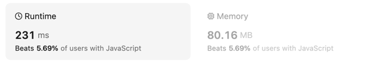

## 题目

[地址](https://leetcode.com/problems/different-ways-to-add-parentheses/description/)

### 我的答案1

按照题目思路，先遍历出搜索算式，再挨个计算算式结果
分两步走，性能太差了



```js
/**
 * @param {string} expression
 * @return {number[]}
 */
var diffWaysToCompute = function(expression) {
    const arr = expression.replace(/([\+\-\*])/g, "|$1|").split('|')
    if (arr.length === 1) {
        return [+arr[0]]
    }
    console.log(arr);
    const rsts = [];
    const sums = [];
    const same = {}
    pieceExp(arr, rsts)
    console.log(rsts);
    rsts.forEach(item => {
        if (!same[item]) {
            same[item] = true;
            sums.push(calcValue(item))
        }
    })
    console.log(sums);
    return sums;
};

// 会有重复结果
function pieceExp(arr, rsts) {
    const dealArr = [];
    for (let index = 0; index < arr.length; index++) {
        const item = arr[index];
        if (['*', '+', '-'].includes(item)) {
            dealArr.push([
                ...arr.slice(0, index - 1),
                `(${arr[index - 1]}${item}${arr[index + 1]})`,
                ...arr.slice(index + 2),
            ]);
        }
    }
    dealArr.forEach(item => {
        if (item.length === 1) {
            rsts.push(item[0])
        } else {
            pieceExp(item, rsts)
        }
    })
}

function calcValue (str) {
    const arr = str.replace(/([\+\-\*])/g, "|$1|").replace(/(\()/g, '$1|').replace(/(\))/g, '|$1').split('|')
    console.log(arr);
    const nums = [];
    const scopes = [];
    let sum = 0;
    for (let i = 0; i < arr.length; i++) {
        if (arr[i] === '(') {
            // nums.push('');
        } else if (arr[i] === ')') {
            if (scopes.length) {
                const expression = scopes.pop();
                const right = nums.pop();
                const left = nums.pop();
                if (expression === '+') {
                    nums.push(left + right)
                } else if (expression === '-') {
                    nums.push(left - right)
                } else if (expression === '*') {
                    nums.push(left * right)
                }
            }
            if (nums.length === 1) {
                sum = nums[0];
            }
        } else if (['*', '+', '-'].includes(arr[i])) {
            scopes.push(arr[i]);
        } else {
            nums.push(+arr[i]);
        }
    }

    return sum;
}

diffWaysToCompute("21-12-1");
```

### 参考答案

利用递归遍历，以加减乘为中间分隔成左算式和右算式，
返回最小算式的结果，再循环组合
(哦，原来这是[分治算法](https://pdai.tech/md/algorithm/alg-core-divide-and-conquer.html))

```js
/**
 * @param {string} input
 * @return {number[]}
 */
var diffWaysToCompute = function(input) {    
    let res = [];
    for (let i = 0; i < input.length; i++) {
        if (isNaN(input[i])) {
            let left = diffWaysToCompute(input.slice(0, i));
            let right = diffWaysToCompute(input.slice(i+1));
            for (let l of left) {
                for (let r of right) {
                    l = Number(l);
                    r = Number(r);
                    
                    if (input[i]=='+') {
                        res.push(l + r);       
                    } else if (input[i]=='-') {
                        res.push(l - r);
                    } else {
                        res.push(l * r);
                    }

                }
            }
        }
    }
    
    if (res.length!=0) return res;
    return [input];
};
```
