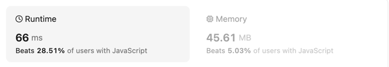

## 题目

[地址](https://leetcode.com/problems/divide-two-integers/description/)

[2,4,5,1,3] -> [2,4,5,3,1] -> [2,5,1,3,4] -> [2,5,1,4,3] -> [2,5,3,1,4]

### 我的答案

组合的整体顺序是以从小到大为开始的组合顺序，所以先排序。
已排序为基础，找到当前那个的位置，然后位置的下一个就是结果



```js

/**
 * @param {number[]} nums
 * @return {void} Do not return anything, modify nums in-place instead.
 */
var nextPermutation = function(nums) {
    const sortNums = [...nums].sort((x,y) => x - y);
    const obj = {}
    judgeNums(sortNums, nums, 0, obj)
    if (!obj.isEnd) {
        nums.reverse()
    }
};

function judgeNums (sortNums, nums, times, obj) {
    const same = {};
    for (let i = 0; i < sortNums.length; i++) {

        const num = sortNums[i];
        if (same[num]) {
            if (i === sortNums.length - 1 && typeof obj[times] === 'number') {
                obj[times] = 'end';
            }
            continue
        } else {
            same[num] = true;
        }
        if (nums[times] === num) {
            const restNums = [...sortNums]
            restNums.splice(i, 1);
            if (restNums.length) {
                judgeNums(restNums, nums, times + 1, obj)
            }

            if (i === sortNums.length - 1) {
                obj[times] = 'end';
            } else {
                obj[times] = i;
            }
        }

        if (!obj.isEnd && obj[times + 1] === 'end' && typeof obj[times] === 'number' && i > obj[times]) {
            nums[times] = num;
            const restNums = [...sortNums]
            restNums.splice(i, 1);
            nums.splice(times + 1, restNums.length, ...restNums)
            obj.isEnd = true;
        }

        if (obj.isEnd) {
            break;
        }

    }
}
```

### 参考答案

总结变换规律，找到最后比前一个数字小的数a，找到最后比a大的数字b,
把a,b换位置，再把a（换位前位置）后所有的数reverse，就是结果（我总结不出，有时候算法要求的真不是逻辑，而是数学或规律）


```js
var nextPermutation = function(nums) {
    let ind1=-1;
    let ind2=-1;
    // step 1 find breaking point
    for(let i=nums.length-2;i>=0;i--){
        if(nums[i]<nums[i+1]){
            ind1=i;
            break;
        }
    }
    // if there is no breaking  point
    if(ind1 === -1){
        reverse(nums,0);
    }

    else{
        // step 2 find next greater element and swap with ind2
        for(let i=nums.length-1;i>=0;i--){
            if(nums[i]>nums[ind1]){
                ind2=i;
                break;
            }
        }

        swap(nums,ind1,ind2);
        // step 3 reverse the rest right half
        reverse(nums,ind1+1);
    }
};

function swap(nums,i,j){
    let temp=nums[i];
    nums[i]=nums[j];
    nums[j]=temp;
}
function reverse(nums,start){
    let i=start;
    let j=nums.length-1;
    while(i<j){
        swap(nums,i,j);
        i++;
        j--;
    }
}
```