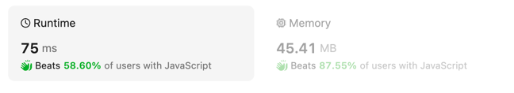

## 题目

[地址](https://leetcode.com/problems/zigzag-conversion/description/)

### 我的答案1



```js
/**
 * @param {string} s
 * @param {number} numRows
 * @return {string}
 */
var convert = function(s, numRows) {
    const arr = Array.from({length: numRows}).map(() => []);

    for (let i = 0; i < s.length; i++) {
        const ii = i % (numRows + numRows - 2);
        const max = numRows - 1;
        const index = ii > max ? max - (ii - max) : ii;
        arr[index].push(s[i])
    }

    return arr.reduce((x,y) => x + y.join(''),'')

};

console.log(convert('PAYPALISHIRING', 3));
```